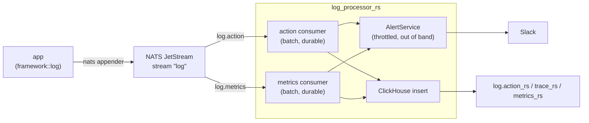

# log_processor_rs — design

## 1. Purpose

`log_processor_rs` is the ingestion tail of the framework's observability pipeline. Every application
built on `framework` publishes its action logs and metrics to NATS JetStream through
`framework_nats::appender`. This service is the single consumer on the other end: it drains those
subjects, writes them into ClickHouse for querying, and raises Slack alerts on the WARN/ERROR ones.

It is a background service only — no HTTP endpoint, no API surface. Its contract is entirely defined
by the NATS subjects it consumes and the ClickHouse tables it owns.

## 2. Architecture



Two independent `BatchConsumer`s run as `System` services, one per subject, sharing an `Arc<AppState>`.
Each pulls up to 5 000 messages or waits 3 s, whichever comes first, then hands the whole batch to its
handler. One batch becomes one ClickHouse insert.

## 3. Module layout

| Path                          | Responsibility                                                                |
| ----------------------------- | ----------------------------------------------------------------------------- |
| `src/main.rs`                 | config, startup wiring, JetStream + ClickHouse schema init, graceful shutdown |
| `src/nats.rs`                 | ClickHouse `Enum8` severity and its mapping from `framework::log::Severity`   |
| `src/nats/action_handler.rs`  | `ActionMessage` batch → `action_rs` + `trace_rs` rows                         |
| `src/nats/metrics_handler.rs` | `MetricsMessage` batch → `metrics_rs` rows                                    |
| `src/alert.rs`                | alert throttling state and message formatting                                 |
| `src/alert/slack.rs`          | `chat.postMessage` client, channel selection per severity                     |

The crate uses the `foo.rs` + `foo/` module layout (no `mod.rs`), as the workspace `mod_module_files`
lint requires.

## 4. Startup and shutdown

`main()` runs in this order, and every step fails fast — a misconfigured service must not start half-alive:

1. `load_config!("assets/conf.json")` resolves each `env:NAME` reference; a missing variable panics.
2. `System::init` + `consumer_metrics()`, then `start_executor()` for out-of-band work.
3. `start_logger(ConsoleAppender)` — **not** the NATS appender. This service consumes the same stream
   it would publish to, so logging to NATS would make it amplify its own actions into a feedback loop.
4. `init_jetstream` creates/updates the `log` stream (`log.>`, 7-day max age, `no_ack`).
5. `init_clickhouse` creates the `log` database and the three tables from `assets/clickhouse/*.sql`.
   Schema is idempotent DDL owned by this service; it is applied on every boot.
6. Both consumers start as `System` services with a shared cancellation token.

Shutdown drains in dependency order: `system.wait()` returns once the consumers stop (a batch always
completes before the cancellation check, so no batch is torn in half), then the executor is given 15 s
to flush in-flight Slack notifications, then the logger flushes last.

## 5. Data flow

### 5.1 Action messages

`ActionMessage` carries the action's identity, severity, context, stats and — only for traced or failed
actions — the full log buffer. The handler walks the batch once and produces two row vectors:

- `action_rs`, one row per message.
- `trace_rs`, one row per message that carried `logs`. This is normally a small fraction of the batch,
  so the trace insert is skipped entirely when the vector is empty.

Two shape conversions happen in `to_action_row`:

- **context splitting** — the wire format is `Vec<(String, Vec<String>)>`. A key with exactly one value
  goes to `context Map(String, String)`; anything else goes to `multi_context Map(String, Array(String))`.
  Most context keys are single-valued, and keeping them in a scalar map makes the common
  `context['x'] = 'y'` query cheap.
- **ref_id splitting** — same idea: a single ref id lands in the indexed `ref_id` column, multiple ids
  land in `ref_ids`.

### 5.2 Metrics messages

A flat mapping into `metrics_rs`. `stats` and `info` become maps; `info` is ZSTD-compressed since it
holds repetitive host/version strings.

### 5.3 Delivery semantics

The consumer uses `AckPolicy::All` and **acks the batch regardless of the handler result**. A failed
ClickHouse insert therefore drops that batch rather than redelivering it. This is deliberate: telemetry
is not business data, and redelivery would risk duplicate rows in a table with no dedup key, which is
worse for the people reading the dashboards than a gap. Insert failures are logged as exceptions and
surface through the service's own metrics.

## 6. ClickHouse schema

All three tables share the same skeleton:

```sql
ENGINE = MergeTree
PARTITION BY toDate(timestamp)
ORDER BY (toStartOfHour(timestamp), app)
TTL timestamp + INTERVAL 30 DAY
SETTINGS ttl_only_drop_parts = 1
```

- **Partition by day, order by (hour, app)** — every query is time-bounded and almost always
  app-bounded, so this prefix eliminates the vast majority of granules.
- **`ttl_only_drop_parts`** — expiry drops whole day-partitions instead of rewriting parts, which keeps
  retention cost near zero.
- **`LowCardinality`** on `app`, `host`, `kind`, `error_code` and map keys — these are dictionaries in
  practice, with cardinality in the tens or low hundreds.
- **Bloom filter indexes** on `id`, `ref_id` and `error_code` — the "find this one action" and "show me
  everything with this error code" lookups are point queries against a huge table.
- **`content` and `info` use `CODEC(ZSTD(3))`** — both are large and highly repetitive.

`severity` is `Enum8('INFO' = 1, 'WARN' = 2, 'ERROR' = 3)`. The local `nats::Severity` mirrors
`framework::log::Severity`'s discriminants exactly: the JSON message carries the name, RowBinary carries
the `i8`, and the two must not drift.

## 7. Alerting

### 7.1 Entry points

`AlertService` takes the wire types directly:

```rust
pub(crate) fn process_action(&self, message: &ActionMessage)
pub(crate) fn process_metrics(&self, message: &MetricsMessage)
```

Both drop `Severity::Info` before doing anything else. The overwhelming majority of actions are INFO, so
this check runs before any allocation or lock acquisition. The internal `Alert<'_>` struct — a borrowed
view of the fields alerting cares about — never leaves the module, so the handlers do not need to know
how an alert is shaped.

### 7.2 Throttling

State is a `Mutex<HashMap<String, AlertStat>>` keyed by `{app}/{severity}/{error_code}`, with a missing
error code normalised to `UNASSIGNED`.

Severity is part of the key even though the requirement reads "same app and error_code". WARN and ERROR
can share an error code, and the two intervals are only well defined if they are counted separately.

| severity | notification interval |
| -------- | --------------------- |
| ERROR    | 1 minute              |
| WARN     | 4 hours               |

Within an interval the alert is suppressed and a counter increments. The first alert past the interval
notifies and reports how many were suppressed, then resets. The count is omitted from the message when
it is zero (the first notification of a key has nothing to count).

Message format:

```
[3] ERROR: my-app
id: 01H...
error_code: DB_TIMEOUT
message: connection timed out
```

State is bounded by `MAX_STATS = 1_000`. When full, entries older than `WARN_INTERVAL` are evicted —
those would have notified on their next alert anyway, so eviction only loses a suppressed count, never a
notification.

**The state is per process and in memory only.** Running more than one replica multiplies the
notification rate by the replica count. This was an explicit simplification: alerting is a single-writer
concern here, and a shared store would be a disproportionate dependency for it.

### 7.3 Not blocking ingestion

Notification is dispatched with `spawn_action!` onto the framework executor, never awaited inline:

```rust
let slack = Arc::clone(&self.slack);
spawn_action!("slack_notify", async move { slack.send(severity, &message).await });
```

Slack is a third-party HTTP dependency on the hot path of every log batch. If it were awaited inline, a
slow or failing Slack would stall ingestion and could fail the batch. Off the path, the worst case is a
lost notification, logged as an exception in its own action.

Only the client is shared with the spawned task, not the whole service — the task has no business
holding the stats mutex. `AlertService::new` takes a plain `SlackClient` and wraps it; the `Arc` is an
implementation detail of how it notifies.

### 7.4 Slack client

A port of the Java `SlackClient`, minus the severity-to-colour mapping. It posts a single attachment to
`chat.postMessage` and owns both channels, picking one from the severity — routing is the client's
concern, not the throttler's. INFO never reaches it, so anything that is not ERROR goes to the warn
channel.

Slack answers `200` with `{"ok": false}` on business errors (`invalid_auth`, `channel_not_found`), so the
response body is parsed and checked, not just the status code.

## 8. Configuration

`assets/conf.json` holds only `env:` references; no value is baked into the image.

| variable                                 | required | purpose                            |
| ---------------------------------------- | -------- | ---------------------------------- |
| `NATS_URI`                               | yes      | JetStream server                   |
| `CLICKHOUSE_URI` / `_USER` / `_PASSWORD` | yes      | ClickHouse connection              |
| `SLACK_TOKEN`                            | no       | bot token; empty disables alerting |
| `SLACK_ERROR_CHANNEL`                    | no       | channel for ERROR                  |
| `SLACK_WARN_CHANNEL`                     | no       | channel for WARN                   |

`EnvString` panics when an `env:` reference resolves to a missing variable, so the Slack variables must
be **defined but may be empty**. `alert_service()` treats any empty value as "not configured", logs
`slack is not configured, alert is disabled`, and returns `None`; the handlers then skip alerting
entirely. This makes the service runnable in a dev environment with no Slack workspace.

## 9. Deployment

Two-stage Dockerfile: `rust:trixie` builds the release binary, `debian:trixie-slim` runs it as uid 1000
with only the binary, `assets/`, and the CA bundle (needed for the outbound HTTPS call to Slack).

The service is horizontally scalable for ingestion — both consumers are durable pull consumers, so
adding replicas splits the batches — but see §7.2 for the alerting caveat.

## 10. Testing

Unit tests cover the pure logic, which is where the behaviour actually lives:

- `to_action_row` — context and ref_id splitting in all four shapes.
- `alert_key` / `message` — key composition, the `UNASSIGNED` fallback, presence and absence of the count.
- `AlertService::check` — first alert, suppression inside the interval, suppressed count on the next
  notification, the longer WARN interval, per-severity independence, and eviction when full.
- `SlackClient::channel` — severity routing.

`check` is tested against `Instant` by rewinding every entry's `last_sent` rather than sleeping, so the
suite stays fast and the 4-hour WARN interval is testable at all.

The NATS and ClickHouse paths have no unit tests — they are thin adapters whose behaviour is the external
system's. They are covered by the e2e suite under `test/`, which requires those services to be running.
